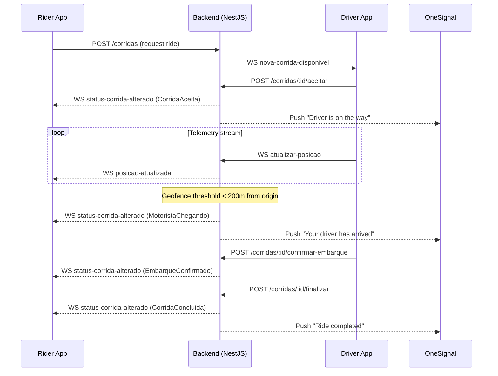

# GovMob v1.2 Real-Time Integration Guide

> Synchronized real-time communication guide for GovMob using WebSockets (Socket.io) and Push notifications (OneSignal).

---

## Architecture Overview

GovMob uses a dual-channel strategy to guarantee critical event delivery:

- WebSocket (`/despacho`): interactive bidirectional channel for frequent telemetry, in-app chat, and UI state updates while the app is open.
- Push (OneSignal): async channel for background delivery and user wake-up notifications on important lifecycle events.

---

## Ride Lifecycle (Happy Path)

---

## Connectivity and Authentication

- Namespace: `/despacho`
- Room model: clients must emit `assinar-corrida` to join ride-specific room updates.

### JWT handshake options

Use one of the following:

1. HTTP header (recommended):
   - `Authorization: Bearer <ACCESS_TOKEN>`
2. Socket.io auth:
   - `auth: { token: '<ACCESS_TOKEN>' }`
3. Query fallback:
   - `?token=<ACCESS_TOKEN>`

Important token format rules:

- Use the `Bearer ` prefix only in HTTP `Authorization` header.
- Do not include `Bearer ` in `auth.token` or query string token.

---

## WebSocket Event Reference

### Client -> Server (commands)

| Event               | Payload                                                                                          | Description                                              |
|---------------------|--------------------------------------------------------------------------------------------------|----------------------------------------------------------|
| `assinar-corrida`   | `{ "corridaId": "uuid" }`                                                                        | Subscribes the socket to ride updates                    |
| `ficar-disponivel`  | `{}`                                                                                             | Adds driver to broadcast pool (`motoristas-disponiveis`) |
| `atualizar-posicao` | `{ "corridaId": "uuid", "lat": number, "lng": number, "velocidade": number, "heading": number }` | Sends telemetry (`heading` 0-359)                        |
| `enviar-mensagem`   | `{ "corridaId": "uuid", "conteudo": "string" }`                                                  | Sends persistent chat message                            |

### Server -> Client (emissions)

| Event                     | Payload                                                     | Description                       |
|---------------------------|-------------------------------------------------------------|-----------------------------------|
| `historico-mensagens`     | `[{ id, remetenteId, conteudo, timestamp }]`                | Sent after `assinar-corrida`      |
| `posicao-atualizada`      | `{ motoristaId, lat, lng, velocidade, heading, timestamp }` | Room broadcast for live telemetry |
| `nova-mensagem`           | `{ id, corridaId, remetenteId, conteudo, timestamp }`       | New chat message notification     |
| `status-corrida-alterado` | `{ corridaId, status, ...metadata }`                        | Ride lifecycle state change       |

### Timestamp and serialization notes

- `nova-mensagem.timestamp`: ISO-8601 string (example: `2026-04-16T12:36:00.000Z`).
- `posicao-atualizada.timestamp`: epoch milliseconds (`Number`, from `Date.now()`).
- Date serialization can vary by payload source; always normalize on the client.

---

## Ride Status Reference (`status-corrida-alterado`)

Status names follow PascalCase:

- `NovaCorridaDisponivel` (broadcast to available drivers)
- `CorridaAceita` (driver assigned)
- `DeslocamentoIniciado` (driver started heading to origin)
- `MotoristaChegando` (auto trigger under 200m or manual `/chegar` flow)
- `EmbarqueConfirmado` (rider onboard)
- `CorridaConcluida` (completed)
- `CorridaCancelada` (cancelled by one party)

---

## Push Synchronization (OneSignal)

Push notifications are backend-driven for reliability.

| Event               | Push Title        | Example Message                                   |
|---------------------|-------------------|---------------------------------------------------|
| `CorridaAceita`     | `Ride Accepted`   | `A driver accepted your ride and is on the way.`  |
| `MotoristaChegando` | `Driver Arriving` | `Your driver is arriving at the pickup location.` |
| `CorridaCancelada`  | `Ride Cancelled`  | `Your ride was interrupted.`                      |

### Proximity automation

The backend evaluates live driver position against ride origin on each telemetry update. When distance crosses 200m for the first time, it emits `MotoristaChegando` automatically.

---

## Chat Persistence Details

Messages sent through `enviar-mensagem` are persistent:

1. Saved to database (`mensagens_corrida`).
2. Assigned unique ID and timestamp.
3. Replicated via WebSocket to room participants.
4. Recoverable via REST `GET /corridas/:id/mensagens`.

---

## Security and Resilience

- Room access validation: server blocks subscriptions to rides that do not belong to the user.
- Geocoding cache: 24h cache for geocoding/reverse geocoding with ~11m reverse precision.
- Address search throttling: `20 requests/minute/user`.

### Token expiry handling

If WebSocket disconnects with `401 Unauthorized`:

1. Refresh JWT.
2. Reconnect socket.
3. Re-emit `assinar-corrida` to rejoin room state.

The server does not preserve room membership for expired sessions.
