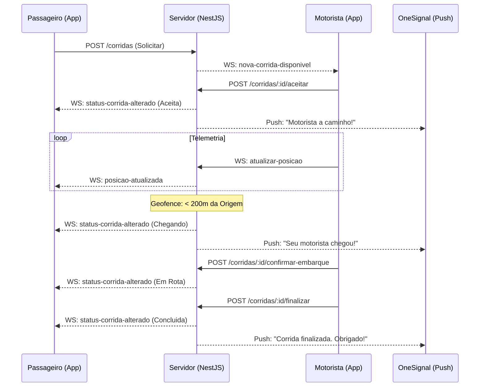

# 🚦 Guia de Integração em Tempo Real (WebSockets & Push) - GovMob v1.2

Este documento descreve o fluxo sincronizado de comunicação em tempo real do GovMob, cobrindo o namespace `/despacho` via WebSockets (Socket.io) e as notificações complementares via Push (OneSignal).

---

## 🌍 Visão Geral da Arquitetura

O GovMob utiliza uma estratégia **Dual-Channel** para garantir a entrega de informações críticas:
- **WebSocket**: Canal bidirecional interativo. Usado para telemetria frequente, chat ao vivo e atualizações de UI enquanto o app está aberto.
- **Push (OneSignal)**: Canal assíncrono. Usado para "acordar" o usuário ou notificá-lo em segundo plano sobre mudanças de estado importantes.

### 🔄 Fluxo de Ciclo de Vida (Happy Path)

---

## 🛠️ Conectividade e Autenticação

- **Namespace**: `/despacho`
-- **Handshake**: O JWT pode ser enviado de duas formas:

- Header HTTP: `Authorization: Bearer <ACCESS_TOKEN>` (recomendado)
- Socket.io auth: `auth: { token: '<ACCESS_TOKEN>' }` (forneça apenas o token, sem o prefixo "Bearer")

Observação: o guard do servidor também verifica `handshake.query.token` (query param `?token=<ACCESS_TOKEN>`). Não use o prefixo "Bearer" ao enviar o token via `auth.token` ou query string.
- **Rooms**: O cliente deve obrigatoriamente emitir `assinar-corrida` para entrar na sala da viagem e começar a receber eventos específicos.

---

## 📡 Referência de Eventos (WebSocket)

### 1️⃣ Cliente ➔ Servidor (Comandos)

| Evento | Payload | Descrição |
| :--- | :--- | :--- |
| `assinar-corrida` | `{ "corridaId": "uuid" }` | Subscreve a conexão às atualizações daquela corrida. |
| `ficar-disponivel` | `{}` | Adiciona o motorista ao pool de broadcast de novas corridas (`motoristas-disponiveis`). |
| `atualizar-posicao` | `{ "corridaId": "uuid", "lat": number, "lng": number, "velocidade": number, "heading": number }` | Envia telemetria. `heading` é a direção (0-359). |
| `enviar-mensagem` | `{ "corridaId": "uuid", "conteudo": "string" }` | Envia mensagem de chat (persistente). |

### 2️⃣ Servidor ➔ Cliente (Emissões)

| Evento | Payload | Descrição |
| :--- | :--- | :--- |
| `historico-mensagens` | `[{ id, remetenteId, conteudo, timestamp }]` | Enviado logo após o `assinar-corrida`. |
| `posicao-atualizada` | `{ motoristaId, lat, lng, velocidade, heading, timestamp }` | Broadcast da telemetria para os assinantes da sala. |
| `nova-mensagem` | `{ id, corridaId, remetenteId, conteudo, timestamp }` | Notificação de nova mensagem no chat. |
| `status-corrida-alterado` | `{ corridaId, status, ...metadata }` | Notificação de mudança no ciclo de vida (ver estados abaixo). |

**Observações sobre timestamps e serialização**:
- `nova-mensagem.timestamp` é enviado como uma string ISO-8601 (por exemplo "2026-04-16T12:36:00.000Z").
- `posicao-atualizada.timestamp` é enviado como epoch milliseconds (Number) conforme implementado no servidor (Date.now()).
- Em geral, os objetos Date no servidor são serializados pelo Socket.io — confirme o formato no cliente antes de processar.

---

## 🚦 Estados do Ciclo de Vida (`status-corrida-alterado`)

Os nomes de status seguem a convenção `PascalCase`:

- `NovaCorridaDisponivel` (Broadcast para motoristas livres)
- `CorridaAceita` (Motorista designado)
- `DeslocamentoIniciado` (Motorista começou a ir para a origem)
- **`MotoristaChegando`** (Gatilho automático < 200m ou manual via `POST /chegar`)
- `EmbarqueConfirmado` (Passageiro no veículo)
- `CorridaConcluida` (Finalizada com sucesso)
- `CorridaCancelada` (Interrompida por uma das partes)

---

## 📱 Sincronização com Push Notifications (OneSignal)

As notificações por Push são codificadas no backend para máxima confiabilidade. Abaixo o mapeamento de mensagens padrão:

| Evento | Título do Push | Mensagem (Exemplo) |
| :--- | :--- | :--- |
| `CorridaAceita` | `Corrida Aceita` | "Um motorista aceitou sua corrida e está a caminho!" |
| `MotoristaChegando` | `Motorista Chegando` | "Seu motorista está chegando ao local de embarque!" |
| `CorridaCancelada` | `Corrida Cancelada` | "A corrida foi interrompida." |

> [!NOTE]
> **Automação Proximidade**: O sistema calcula a distância de todos os motoristas em corrida ativa a cada atualização de posição. Ao cruzar o raio de **200 metros** do ponto de origem pela primeira vez, o evento `MotoristaChegando` é disparado automaticamente.

---

## 💬 Detalhes do Chat (Persistência)

O chat do GovMob não é "volátil". Toda mensagem enviada via `enviar-mensagem`:
1. É salva no banco de dados (`mensagens_corrida`).
2. Recebe um ID único e timestamp.
3. É replicada via WebSocket.
4. Pode ser recuperada a qualquer momento via REST: `GET /corridas/:id/mensagens`.

---

## 🔒 Segurança e Resiliência

- **Validação de Sala**: O servidor impede que um usuário assine uma corrida que não lhe pertence.
- **Cache de Localização**: Resultados de geocodificação são cacheados por **24 horas** com precisão de ~11m para geocodificação reversa.
- **Throttling**: O endpoint de pesquisa de endereços é limitado a **20 requisições por minuto** por usuário.

---

> [!CAUTION]
> **Token Expiry**: Em caso de desconexão com erro 401 (Unauthorized), a biblioteca cliente deve obter um novo JWT e tentar a reconexão. O servidor não mantém o estado da sala para conexões expiradas.
